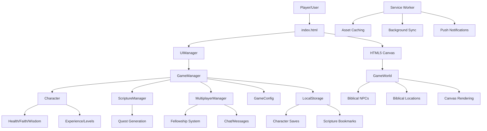
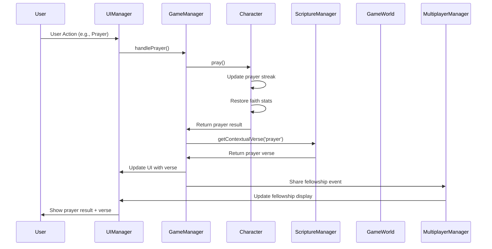
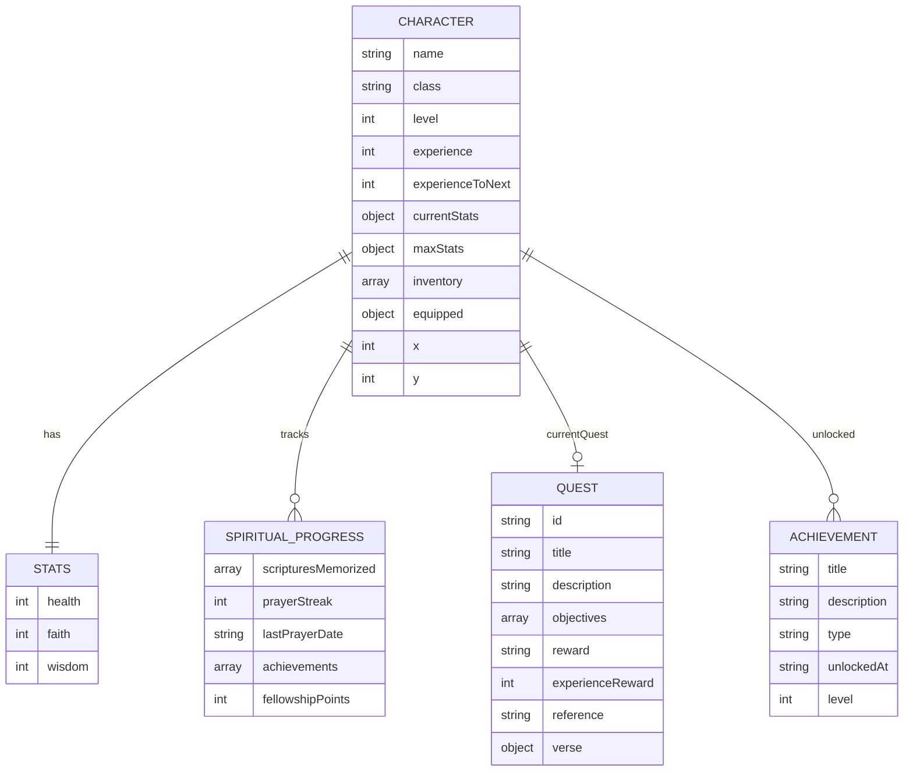
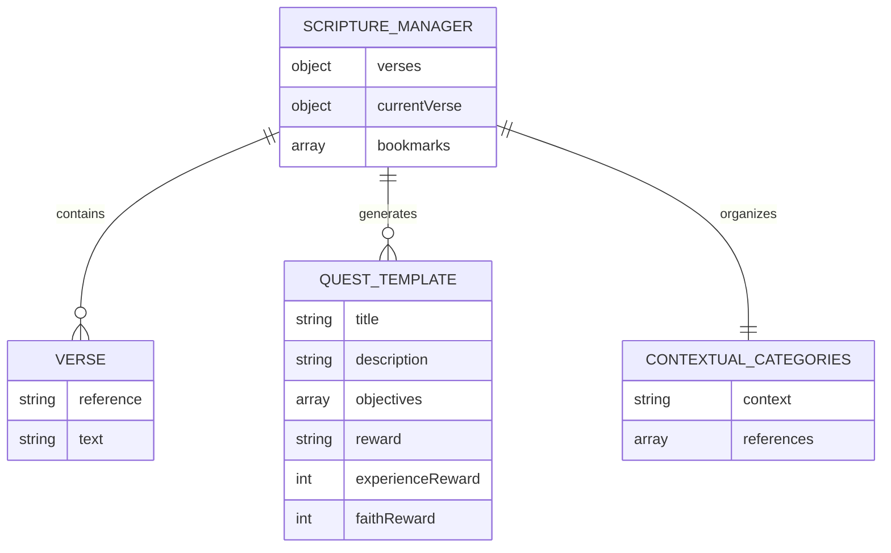
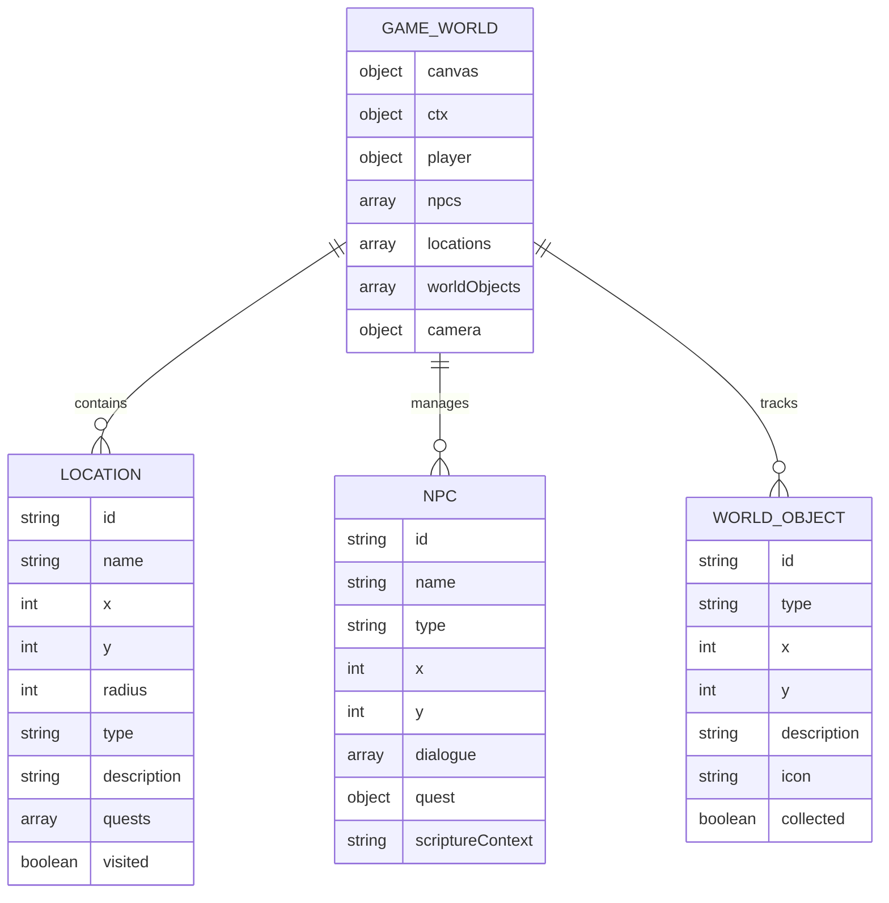
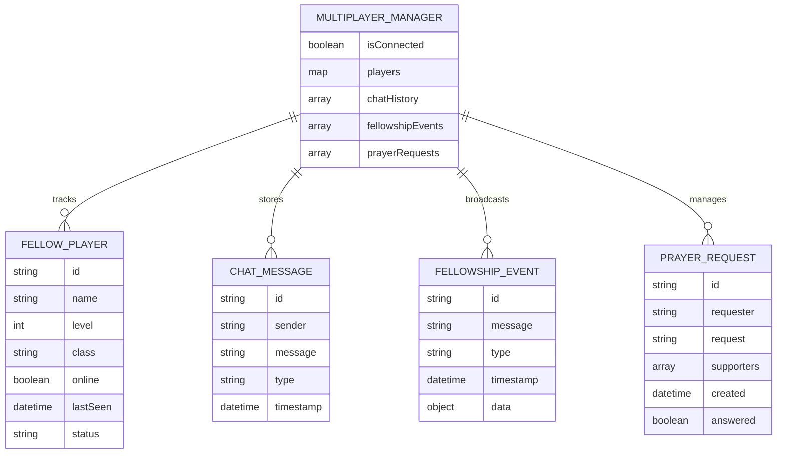
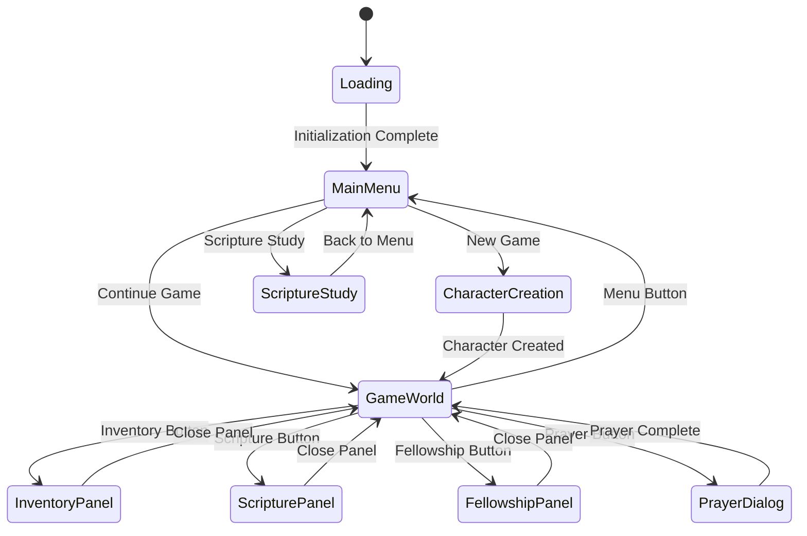
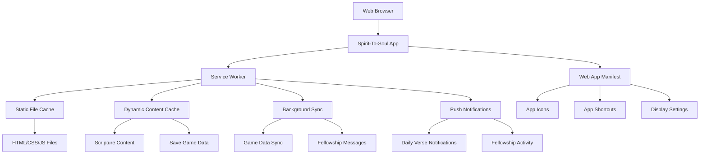
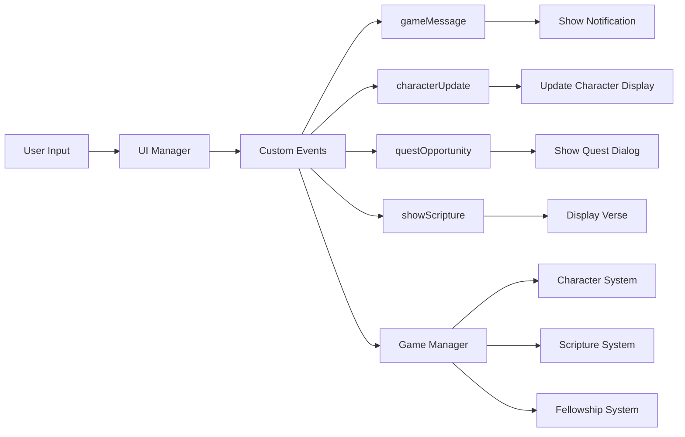
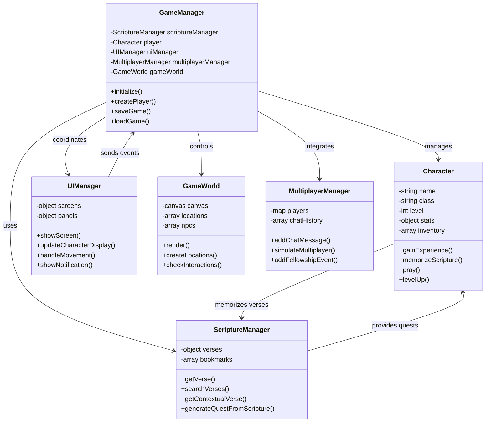

# Spirit-To-Soul Architecture Diagrams and Schemas

## System Architecture Overview



## Data Flow Diagram



## Character Progression Schema



## Scripture System Schema



## Game World Schema



## Multiplayer/Fellowship Schema



## UI State Flow



## PWA Architecture



## Event System Flow



## Save Data Schema

```json
{
  "version": "1.0.0",
  "timestamp": 1640995200000,
  "player": {
    "name": "PlayerName",
    "class": "DISCIPLE",
    "level": 5,
    "experience": 350,
    "experienceToNext": 156,
    "maxStats": {
      "health": 120,
      "faith": 105,
      "wisdom": 85
    },
    "currentStats": {
      "health": 120,
      "faith": 95,
      "wisdom": 85
    },
    "position": {
      "x": 400,
      "y": 300
    },
    "inventory": ["Sacred Scroll", "Bread of Life"],
    "equipped": {
      "weapon": "Sword of the Spirit",
      "armor": "Breastplate of Righteousness",
      "accessory": "Cross of Salvation"
    },
    "scripturesMemorized": ["John 3:16", "Psalm 23:1", "Romans 8:28"],
    "prayerStreak": 7,
    "lastPrayerDate": "2023-12-31",
    "achievements": [
      {
        "title": "First Scripture",
        "description": "Memorized your first verse",
        "type": "spiritual",
        "unlockedAt": "2023-12-25T10:00:00.000Z",
        "level": 1
      }
    ],
    "fellowshipPoints": 25,
    "encouragementsGiven": 5,
    "scripturesShared": 3,
    "questsCompleted": [
      {
        "id": "welcome",
        "title": "Welcome to Your Spiritual Journey",
        "completionTime": 1640995000000,
        "duration": 300000
      }
    ],
    "currentQuest": null
  },
  "gameWorld": {
    "visitedLocations": ["JERUSALEM", "BETHLEHEM"],
    "discoveredNPCs": ["prophet_elijah", "disciple_john"],
    "collectedObjects": ["scroll_1", "bread_2"]
  },
  "settings": {
    "musicVolume": 0.7,
    "soundEffects": true,
    "autoSave": true
  }
}
```

## Class Inheritance and Relationships



This architectural documentation provides a comprehensive view of how all components in Spirit-To-Soul work together to create a cohesive biblical gaming experience, with clear data flows, relationships, and schemas for all major systems.