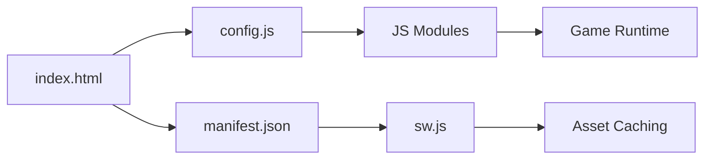

# Spirit-To-Soul Configuration Files Documentation

## Overview
This document explains all configuration files in the Spirit-To-Soul project and their roles in creating the biblical RPG experience.

## Core Configuration Files

### 1. `js/config.js` - Game Configuration
**Purpose**: Centralized game constants and character class definitions
**Type**: JavaScript configuration object
**Dependencies**: None (core foundation file)

#### Key Sections:
```javascript
// Canvas and rendering settings
CANVAS_WIDTH: 800,
CANVAS_HEIGHT: 600,
PLAYER_SPEED: 2,
PLAYER_SIZE: 20

// Game state management
STATES: {
    LOADING: 'loading',
    MENU: 'menu',
    CHARACTER_CREATION: 'character_creation',
    GAME_WORLD: 'game_world',
    SCRIPTURE_STUDY: 'scripture_study'
}
```

#### Character Classes Configuration:
- **DISCIPLE**: Balanced spiritual growth (Health: 100, Faith: 80, Wisdom: 70)
- **PROPHET**: Spiritual authority focus (Health: 80, Faith: 100, Wisdom: 90)  
- **SHEPHERD**: Protection ministry (Health: 120, Faith: 70, Wisdom: 60)
- **SCRIBE**: Knowledge mastery (Health: 70, Faith: 85, Wisdom: 100)

#### Biblical Locations:
- World coordinates for Jerusalem (400, 300), Bethlehem (350, 350)
- Sacred sites including Jordan River, Mount Sinai, Garden of Eden
- Each location includes name, position, and spiritual significance

#### Usage Examples:
```javascript
// Access character class data
const discipleData = GameConfig.CHARACTER_CLASSES.DISCIPLE;

// Get biblical location coordinates  
const jerusalemPos = GameConfig.LOCATIONS.JERUSALEM;

// Check game state constants
if (currentState === GameConfig.STATES.GAME_WORLD) {
    // Initialize world view
}
```

### 2. `manifest.json` - PWA Configuration
**Purpose**: Progressive Web App settings for device installation and platform integration
**Type**: JSON configuration file
**Dependencies**: Asset files (icons, screenshots)

#### Core Properties:
```json
{
  "name": "Spirit To Soul - Biblical RPG Adventure",
  "short_name": "Spirit To Soul",
  "version": "1.0.0",
  "start_url": "/",
  "display": "standalone",
  "orientation": "any"
}
```

#### Icon Configuration:
- Multiple sizes from 72x72 to 512x512 pixels
- Purpose: "any maskable" for cross-platform compatibility
- PNG format for optimal quality and compatibility

#### App Shortcuts:
- **Continue Journey**: Resume saved spiritual adventure
- **Scripture Study**: Direct access to biblical content
- **Fellowship Hall**: Connect with spiritual community

#### Platform Features:
- **Edge Side Panel**: Optimized 400px width for Microsoft Edge
- **Categories**: games, education, lifestyle classification
- **Screenshots**: Platform-specific promotional images

### 3. `sw.js` - Service Worker Configuration  
**Purpose**: PWA offline functionality, caching, and background services
**Type**: JavaScript service worker script
**Dependencies**: Game assets and dynamic content

#### Cache Configuration:
```javascript
const CACHE_NAME = 'spirit-to-soul-v1.0.0';
const STATIC_CACHE = 'spirit-static-v1.0.0';
const DYNAMIC_CACHE = 'spirit-dynamic-v1.0.0';

// Static files cached for offline access
const STATIC_FILES = [
    '/', '/index.html', '/css/styles.css',
    '/js/config.js', '/js/scripture.js', '/js/character.js',
    '/js/game-world.js', '/js/ui.js', '/js/multiplayer.js',
    '/js/main.js', '/manifest.json'
];
```

#### Background Sync Events:
- **sync-game-data**: Character progress and save synchronization
- **sync-fellowship-messages**: Community communication backup
- **daily-scripture-update**: Periodic spiritual content refresh

#### Push Notification Setup:
- Fellowship activity alerts and encouragement messages
- Daily verse notifications for spiritual discipline
- Community prayer request updates and support

### 4. `index.html` - Application Structure
**Purpose**: Single-page application layout and screen definitions
**Type**: HTML5 document structure
**Dependencies**: CSS stylesheets and JavaScript modules

#### Screen Organization:
- **Loading Screen**: Spiritual-themed initialization with progress bar
- **Main Menu**: Game navigation with save game detection
- **Character Creation**: Biblical class selection and spiritual path choice
- **Game World**: Primary gameplay interface with canvas and controls
- **Scripture Study**: Dedicated biblical content exploration

#### Meta Configuration:
```html
<meta name="viewport" content="width=device-width, initial-scale=1.0">
<meta name="description" content="A massive online, open world action-adventure RPG inspired by the King James Version of The Bible">
<link rel="manifest" href="manifest.json">
<link rel="icon" type="image/x-icon" href="assets/favicon.ico">
```

#### Module Loading Order:
1. config.js - Core constants and definitions
2. scripture.js - Biblical content system  
3. character.js - Player progression mechanics
4. game-world.js - Spatial world management
5. ui.js - Interface coordination
6. multiplayer.js - Fellowship community features
7. main.js - System orchestration and initialization

### 5. `.gitignore` - Version Control Configuration
**Purpose**: Exclude build artifacts and dependencies from repository
**Type**: Git configuration file
**Dependencies**: Development and deployment tools

#### Key Exclusions:
```gitignore
# Dependencies and artifacts
node_modules/
dist/
build/
.cache/

# Environment and secrets
.env
.env.local

# Editor and OS files
.vscode/
.DS_Store
Thumbs.db

# PWA build files  
**/sw.js.map
```

## Configuration Relationships

### Dependency Chain:
1. **index.html** → **manifest.json** → **sw.js** (PWA setup)
2. **config.js** → All JavaScript modules (shared constants)
3. **sw.js** → Static file list (caching configuration)
4. **.gitignore** → Build and deployment processes

### Runtime Configuration Flow:


## Environment-Specific Configuration

### Development Setup:
- Local HTTP server for testing (Python, Node.js, or static server)
- Browser DevTools for debugging and console inspection
- No build process required - direct file serving

### Production Deployment:
- HTTPS required for PWA features and service worker
- Proper MIME types for JavaScript modules
- Asset optimization and compression recommended
- CDN integration for improved performance

### Mobile Optimization:
- Responsive viewport meta tag configuration
- Touch-friendly control sizing in CSS
- Service worker offline-first strategy
- Battery-efficient animation and rendering

## Configuration Best Practices

### 1. Constants Management:
```javascript
// Good - Use GameConfig for all constants
const playerSpeed = GameConfig.PLAYER_SPEED;

// Avoid - Hard-coded magic numbers
const playerSpeed = 2;
```

### 2. Service Worker Updates:
```javascript
// Update cache names for new versions
const CACHE_NAME = 'spirit-to-soul-v1.1.0'; // Increment version

// Handle version migration gracefully
if (saveData.version !== GameConfig.VERSION) {
    // Migration logic here
}
```

### 3. Cross-Platform Compatibility:
```json
// Manifest.json - Support multiple platforms
"icons": [
    {"src": "assets/icon-192x192.png", "sizes": "192x192", "type": "image/png"},
    {"src": "assets/icon-512x512.png", "sizes": "512x512", "type": "image/png"}
]
```

### 4. Security Considerations:
- No API keys or secrets in client-side configuration
- HTTPS enforcement for production deployment
- Content Security Policy (CSP) headers recommended
- Spiritual content appropriateness validation

## Configuration Validation

### Required Files Checklist:
- [ ] `js/config.js` - Game constants and character classes
- [ ] `manifest.json` - PWA configuration with all required properties
- [ ] `sw.js` - Service worker with caching and offline support
- [ ] `index.html` - Application structure with proper meta tags
- [ ] `.gitignore` - Version control exclusions

### Validation Commands:
```bash
# Check manifest.json validity
npx pwa-asset-generator --manifest-only

# Validate service worker registration
chrome://inspect/#service-workers

# Test PWA installation
chrome://flags/#bypass-app-banner-engagement-checks
```

### Configuration Testing:
1. **Offline Mode**: Disable network and verify functionality
2. **Installation**: Test app installation on multiple devices  
3. **Character Classes**: Verify all four biblical classes load properly
4. **Scripture Database**: Confirm all references resolve correctly
5. **Save/Load**: Test configuration version compatibility

This comprehensive configuration documentation ensures proper setup, maintenance, and extension of the Spirit-To-Soul biblical RPG platform across all supported environments and devices.